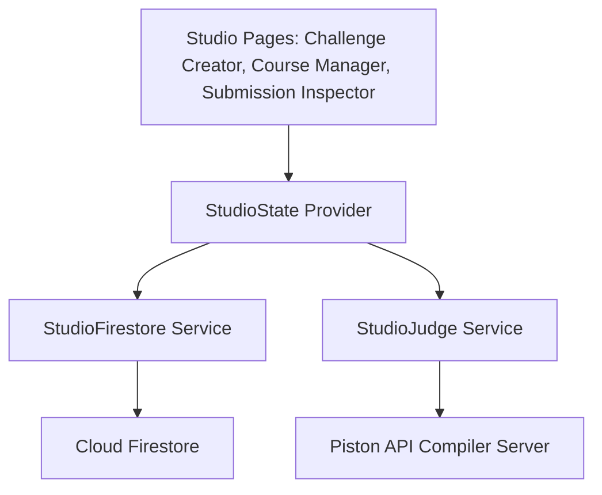

# BitStride Studio — Developer Wiki

Welcome to the **BitStride Studio** Developer Wiki. This document serves as the technical documentation for the administrative, challenge design, and submission-review portal.

---

## 1. System Architecture & Admin State Flow

BitStride Studio is the control plane of the BitStride educational suite. It allows administrators, teachers, and content managers to orchestrate courses, lessons, and challenges.



### Global Session Management (`StudioState`)
The portal's state is encapsulated in **StudioState** ([studio_state.dart](file:///C:/Users/Mihai/Desktop/Bitsride%20Temp/BitStride_Studio/lib/providers/studio/studio_state.dart)):
* **Admin Verification**: Ensures that only authenticated users with administrative flags set on their user document can edit curricula or evaluate reviews.
* **Challenge Scribing Cache**: Caches local copies of challenges during creation phases so that draft updates are not lost during network fluctuations.
* **Review Pipeline State**: Holds active student submissions loaded from Firestore, managing filter criteria (pending, approved, rejected).

---

## 2. Curriculum Content Manager

The Curriculum Content Manager ([course_manager_screen.dart](file:///C:/Users/Mihai/Desktop/Bitsride%20Temp/BitStride_Studio/lib/screens/course/course_manager_screen.dart)) enables hierarchical layout creation:

```
[Course Document] ---> [Topics list] ---> [Lessons List] ---> [Interactive Quizzes]
```

* **Dynamic Syllabus Generation**: Content editors design course syllabi (e.g., C++ Basics, Advanced Python) directly within the dashboard.
* **Lesson Editor Page** ([lesson_editor_page.dart](file:///C:/Users/Mihai/Desktop/Bitsride%20Temp/BitStride_Studio/lib/screens/lesson/lesson_editor_page.dart)): A split-pane layout featuring:
  - *Left Pane*: Markdown editor with real-time word count and syntax validation.
  - *Right Pane*: Visual interactive preview rendering the parsed markdown output, ensuring formatting, lists, tables, and code blocks render correctly before deployment.

---

## 3. Interactive Coding Challenge Designer

The Challenge Designer ([create_screen.dart](file:///C:/Users/Mihai/Desktop/Bitsride%20Temp/BitStride_Studio/lib/screens/challenge/create_screen.dart)) is a robust development board for creating automated test problems:

* **Metadata Declarations**: Input fields for titles, descriptions, difficulty categories (Easy, Medium, Hard), tags, and baseline XP rewards.
* **Dynamic Test Case Form Cards** ([test_case_card.dart](file:///C:/Users/Mihai/Desktop/Bitsride%20Temp/BitStride_Studio/lib/widgets/create_screen/test_case_card.dart)):
  - *Standard Inputs*: Define console-based stdin inputs and expected stdout outputs.
  - *File-based Inputs/Outputs*: Allows developers to designate a virtual input file name (e.g. `date.in`) along with its target string contents, and an output file (e.g. `date.out`) with expected outputs. During execution, the evaluator creates these virtual files dynamically.
  - *Hidden Flag*: Marks test cases as hidden from the student UI to prevent hardcoded outputs.
* **File setup rows**: Allows attaching static configuration or template files that should load beside the main program (e.g. library templates, header files).

---

## 4. Compiler Execution & Test Verification

Before any coding challenge is published to Firestore, the admin is **required** to test and verify the challenge using the built-in compiler validation loop in **StudioJudge** ([studio_judge.dart](file:///C:/Users/Mihai/Desktop/Bitsride%20Temp/BitStride_Studio/lib/services/judge/studio_judge.dart)).

```
[Write Solution Code] ---> [Press Verify Challenge] ---> [Run All Test Cases against Piston] ---> [Green Light (Passes All)] ---> [Unlock Publish button]
```

### Studio Judge Engine Process:
1. **Dynamic Configuration Sync**: Loads the secure Cloudflare Tunnel endpoint URL from Firestore (`config/piston` doc).
2. **Payload Construction**: Prepares the solution code in Python or C++, packages the associated test files, stdin buffers, and runtime execution limitations (`run_timeout`, `run_memory_limit`).
3. **Execution Verification**: Evaluates the response payload from the Piston executor, verifying if:
   - Output matches the expected results (`stdout` or file content block).
   - Resources consumed stay within limits (Memory/CPU).
   - The solution passes all defined test cases.
4. **Publish Authorization**: The UI locks the "Publish Challenge" button until a reference solution compiles and passes all test cases successfully, ensuring no broken exercises are published to learners.

---

## 5. Submission Review Dashboard

The Review Screen ([review_screen.dart](file:///C:/Users/Mihai/Desktop/Bitsride%20Temp/BitStride_Studio/lib/screens/challenge/review_screen.dart)) is an editor interface for examining student work:

* **Submissions Registry**: Fetches submitted student code files grouped by challenge ID, timestamp, and user profile metadata.
* **Administrative Code Comparison**: Uses side-by-side visual panels with syntax highlighting to compare the student's submission against the reference solution code.
* **Grading Workflows**: Includes direct status controls (Approve Challenge, Request Revision, Reject/Archive) along with custom comment threads that sync directly back to the student's Core notification feed.

---

## 6. Project Setup & Web Deployments

### Prerequisites
* Flutter SDK (Target Version: `^3.22.x` or newer)
* Dart SDK (Target Version: `^3.5.4` or newer)
* Firebase CLI installed for hosting configurations

### Local Setup & Compilation Guide
1. **Fetch Packages**:
   ```bash
   flutter pub get
   ```
2. **Setup Credentials**:
   > [!IMPORTANT]
   > Ensure that the administrative project has its specific Firebase credentials configured:
   > - Web Client: Copy options settings to `lib/firebase_options.dart`.
   > Without this connection setup, the Studio application will fail to initialize.

3. **Launch Consoles**:
   - For Web App development (runs on default port):
     ```bash
     flutter run -d chrome
     ```

### Deploying to GitHub Pages
1. Build the production web bundle:
   ```bash
   flutter build web --release --base-href "/bitstride_studio/"
   ```
2. **Routing Considerations**:
   Since GitHub Pages is a static file host and does not rewrite unknown routes back to `index.html`, Flutter apps using clean path URLs will throw 404 errors on browser refreshes. 
   - **Recommended Solution**: Force the application to use the hash URL strategy:
     ```dart
     import 'package:flutter_web_plugins/url_strategy.dart';
     
     void main() {
       usePathUrlStrategy(); // If using custom SPA redirections on hosting, or keep commented for default hash routing
       runApp(const MyApp());
     }
     ```
   - Deploy the contents of the `build/web/` directory directly to your GitHub Pages branch.
