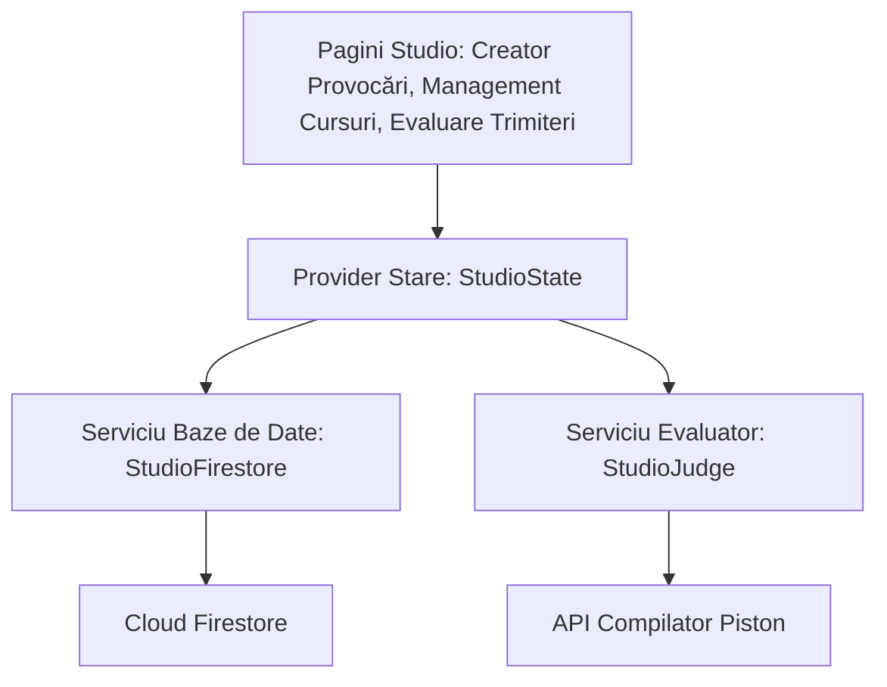

# BitStride Studio — Wiki pentru Dezvoltatori

Bun venit la Wiki-ul pentru dezvoltatori al **BitStride Studio**. Acest document servește ca documentație tehnică pentru portalul administrativ de proiectare a provocărilor și de recenzare a codului trimis.

---

## 1. Arhitectura Sistemului și Managementul Stării (Admin)

BitStride Studio reprezintă panoul de control al suitei educaționale BitStride. Acesta permite administratorilor, profesorilor și creatorilor de conținut să organizeze cursurile, lecțiile și provocările de codare.



### Managementul Sesiunii Globale (`StudioState`)
Starea portalului este încapsulată în **StudioState** ([studio_state.dart](file:///C:/Users/Mihai/Desktop/Bitsride%20Temp/BitStride_Studio/lib/providers/studio/studio_state.dart)):
* **Verificarea Rolului de Administrator**: Asigură că numai utilizatorii autentificați care au rolul de administrator setat în profilul lor din baza de date pot modifica curricula sau pot valida trimiterile elevilor.
* **Memorarea Provocărilor în Curs de Editare**: Păstrează în cache-ul local modificările aduse provocărilor aflate în stadiu de ciornă, evitând pierderea muncii în cazul deconectării rețelei.
* **Fluxul de Corectare**: Administrează trimiterile active ale elevilor preluate din Firestore, oferind posibilitatea de filtrare (în așteptare, aprobate, respinse).

---

## 2. Managerul de Curriculă și Conținut

Modulul de Management al Curriculei ([course_manager_screen.dart](file:///C:/Users/Mihai/Desktop/Bitsride%20Temp/BitStride_Studio/lib/screens/course/course_manager_screen.dart)) permite organizarea ierarhică a conținutului:

```
[Document Curs] ---> [Listă Teme/Topici] ---> [Listă Lecții] ---> [Chestionare Interactive Quizzes]
```

* **Generarea Dinamică a Programei**: Creatorii pot edita structura unui curs (ex: Introducere în C++, Structuri de date în Python) direct din interfață.
* **Editorul de Lecții Markdown** ([lesson_editor_page.dart](file:///C:/Users/Mihai/Desktop/Bitsride%20Temp/BitStride_Studio/lib/screens/lesson/lesson_editor_page.dart)): O pagină structurată în două panouri paralele:
  - *Panoul Stâng*: Editor de text tip Markdown cu contor de cuvinte și validare dinamică a formatării.
  - *Panoul Drept*: Previzualizare interactivă în timp real a textului formatat, asigurându-se că tabelele, listele și blocurile de cod se randează corect înainte de salvare.

---

## 3. Modulul de Proiectare a Provocărilor de Codare (Sandbox)

Interfața de creare a provocărilor ([create_screen.dart](file:///C:/Users/Mihai/Desktop/Bitsride%20Temp/BitStride_Studio/lib/screens/challenge/create_screen.dart)) oferă instrumente complete pentru definirea testelor automate:

* **Declarații de Metadata**: Câmpuri dedicate pentru titlu, descriere, nivel de dificultate (Ușor, Mediu, Dificil), etichete și recompensa de bază în XP.
* **Formularea Dinamică a Testelor (Test Cases)** ([test_case_card.dart](file:///C:/Users/Mihai/Desktop/Bitsride%20Temp/BitStride_Studio/lib/widgets/create_screen/test_case_card.dart)):
  - *Intrări Standard*: Definirea canalului standard de intrare (stdin) și a textului standard așteptat la ieșire (stdout).
  - *Fișiere Virtuale (Input/Output)*: Permite specificarea numelui unui fișier virtual de intrare (ex: `date.in`) cu conținutul aferent, și a fișierului de ieșire (ex: `date.out`) cu răspunsul așteptat. La rulare, evaluatorul creează aceste fișiere temporar în sandbox.
  - *Setarea "Hidden"*: Ascunde testul din interfața utilizatorului pentru a preveni rezolvările prin hardcodarea directă a rezultatului în codul elevului.
* **Fișiere Suplimentare de Suport**: Adăugarea de fișiere șablon, antete sau biblioteci ajutătoare care se vor compila împreună cu codul trimis.

---

## 4. Rularea Evaluatorului și Validarea Provocărilor

Înainte ca o provocare să fie publicată pe platformă în Firestore, administratorul este **obligat** să testeze și să valideze problema utilizând funcționalitatea de testare din **StudioJudge** ([studio_judge.dart](file:///C:/Users/Mihai/Desktop/Bitsride%20Temp/BitStride_Studio/lib/services/judge/studio_judge.dart)).

```
[Scriere Cod de Rezolvare] ---> [Apăsare buton Verificare] ---> [Rulare teste pe Piston] ---> [Confirmare trecere teste] ---> [Deblocare publicare Firestore]
```

### Etapele Evaluării din Studio:
1. **Sincronizarea Configurației**: Preia URL-ul tunelului Cloudflare din Firestore (documentul `config/piston`).
2. **Pachetul de Execuție**: Pregătește fișierul cu codul sursă de rezolvare (C++ sau Python), fișierele suplimentare, datele de intrare și limitele fizice stabilite (`run_timeout`, `run_memory_limit`).
3. **Verificarea Răspunsului**: Analizează răspunsul trimis de serverul Piston, atestând dacă:
   - Rezultatul afișat corespunde cu cel așteptat (prin consolă sau în fișier).
   - Execuția s-a încadrat în limitele de timp și memorie.
   - Soluția trece toate testele de evaluare definite.
4. **Permisiunea de Publicare**: Aplicația deblochează butonul "Publish Challenge" doar după ce codul de referință a trecut cu succes toate testările, evitând publicarea unor exerciții cu erori.

---

## 5. Panoul de Corectare și Evaluare Trimiteri

Ecranul de Evaluare ([review_screen.dart](file:///C:/Users/Mihai/Desktop/Bitsride%20Temp/BitStride_Studio/lib/screens/challenge/review_screen.dart)) permite profesorilor să inspecteze manual codul scris de elevi:

* **Registrul Trimiterilor**: Afișează o listă cronologică a codurilor trimise de utilizatori, ordonate după probleme, dată și profilul elevului.
* **Vizualizator Comparativ**: Oferă ecrane divizate cu evidențiere de sintaxă pentru a compara codul elevului cu rezolvarea optimă propusă de profesor.
* **Controlul Statusului**: Permite schimbarea rapidă a stării problemei (Aprobat, Solicită Revizuire, Respins), trimițând automat notificări și comentarii pe ecranul elevului în versiunea Core.

---

## 6. Configurare Proiect și Găzduire Web

### Cerințe Preliminare
* Flutter SDK (Versiune Minimă: `^3.22.x`)
* Dart SDK (Versiune Minimă: `^3.5.4`)
* Firebase CLI instalat (pentru publicarea pe cloud)

### Instalare și Rulare
1. **Descarcă Dependințele**:
   ```bash
   flutter pub get
   ```
2. **Chei și Credențiale**:
   > [!IMPORTANT]
   > Aplicația necesită credențialele administrative de Firebase:
   > - Web Client: Configurați `lib/firebase_options.dart`.
   > În absența acestora, serviciile Cloud Firestore și Firebase Auth nu vor putea fi accesate.

3. **Lansarea în Execuție**:
   - Rulare în Browser (Web):
     ```bash
     flutter run -d chrome
     ```

### Găzduirea pe GitHub Pages
1. Compilați bundle-ul web de producție:
   ```bash
   flutter build web --release --base-href "/bitstride_studio/"
   ```
2. **Configurarea Rutelor**:
   Deoarece GitHub Pages nu are suport pentru redirectări automate Single Page App (SPA) la reîmprospătare (browser refresh), se recomandă utilizarea strategiei de hash-routing:
   - **Soluție**: Lăsați activ routing-ul implicit bazat pe hash uri în main, sau folosiți un script de redirect în `404.html`.
   - Încărcați fișierele din `build/web/` direct pe branch-ul destinat paginilor web de pe GitHub.
